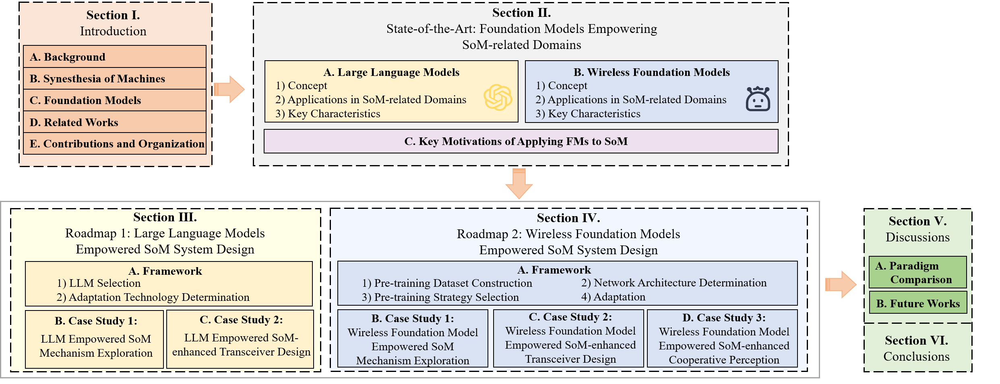

# Foundation Model Empowered Synesthesia of Machines (SoM): AI-native Intelligent Multi-Modal Sensing-Communication Integration
Cheng, Xiang, et al. "Foundation Model Empowered Synesthesia of Machines (SoM): AI-native Intelligent Multi-Modal Sensing-Communication Integration." IEEE Transactions on Network Science and Engineering, 2025, (early acess). [[paper]](https://arxiv.org/abs/2506.07647)
<br>

<p align="center">

<p>

---

## 📌 Overview

In our survey, we propose two roadmaps for enabling AI-native multi-modal sensing-communication integration using **Foundation Models (FMs)**:

- **Roadmap 1**: Large Language Models Empowered SoM System Design  
- **Roadmap 2**: Wireless Foundation Models Empowered SoM System Design  

A total of **five case studies** are discussed in the paper. Due to some of them being based on manuscripts not yet published, we only release code for **two representative case studies**, one from each roadmap:

| Case Study         | Roadmap Origin | Folder Path          |
|--------------------|----------------|-----------------------|
| Case Study 1.2     | Roadmap 1      | `./Case_Study_1.2/`   |
| Case Study 2.2     | Roadmap 2      | `./Case_Study_2.2/`   |

---
## 📁 Directory Structure

Each case study is structured as follows:

```bash
Case Study X.Y/
├── Codes/              # Main source code and inference script
│   ├── Inference.py   # Entry point for reproduction
│   ├── Weights/       # Pretrained model weights (download separately)
│   └── data/          # Input data (download separately)
├── requirements.txt   # Python dependency list
```

> 📥 **Weights and data are provided via Baidu Cloud Disk [Download link]( https://pan.baidu.com/s/1hbxZhq3M22rAdH_dbmyAzQ?pwd=PCNI ).** Please download and place them under the corresponding `Codes/` folder as described below.

 
---

## 🚀 Quick Start

### 1. Clone the repository

```bash
git clone https://github.com/liuboxun/FM4SoM.git
cd FM4SoM/Case_Study_1.2/Codes    # Or cd Case_Study_2.2/Codes
```

### 2. Install dependencies

```bash
pip install -r requirements.txt
```

> 💡 Tip: It is recommended to use a virtual environment like `conda`.

### 3. Prepare weights and data

Download the `Weights/` and `data/` folders from the link above and place them under the `Codes/` directory.

### 4. Run the inference script

```bash
python Inference.py
```

This will reproduce the results for the selected case study as described in the paper.

---

## 📄 Citation

If you find our work helpful, please consider citing:

```bibtex
@article{liu2025fm4som,
  title     = {Foundation Model Empowered Synesthesia of Machines (SoM): AI-native Intelligent Multi-Modal Sensing-Communication Integration},
  author    = {Cheng, Xiang and Liu, Boxun and Liu, Xuanyu and Liu, Ensong and Huang, Ziwei},
  journal   = {IEEE Transactions on Network Science and Engineering},
  year      = {2025},
  note      = {Early Access},
}
```

